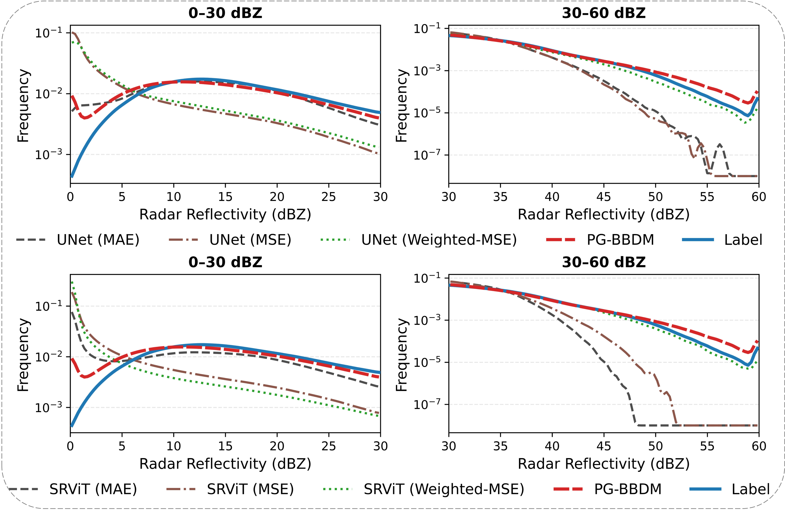

# PG-BBDM

Official repository for **PG-BBDM: Physics-Guided Brownian Bridge Diffusion Model for Long-Tailed Convective Radar Reflectivity Reconstruction from Satellite Observations**.

**Under review at IEEE Transactions on Geoscience and Remote Sensing (TGRS). Code will be released upon acceptance.**

---

## Overview

PG-BBDM is a physics-guided latent diffusion framework for reconstructing radar reflectivity from satellite observations.  
It is designed to better recover the long-tailed distribution of radar reflectivity, especially in high-reflectivity convective regions.

The framework includes three main components:

- **Convection Localization Prior (CLP)**
- **Physics-Guided Noise Modulation (PGNM)**
- **Cross-Space Consistency Loss (CSCL)**

---

## Motivation

  

---

## Framework

  

---

## Input and Output Examples

  

---

## Results

  

---

## Code Availability

The full implementation is not public at this stage.  
The repository currently provides the main figures and visual results of the paper.  
The complete codebase, including training, inference, preprocessing, and evaluation scripts, will be released after the paper is accepted.

---
